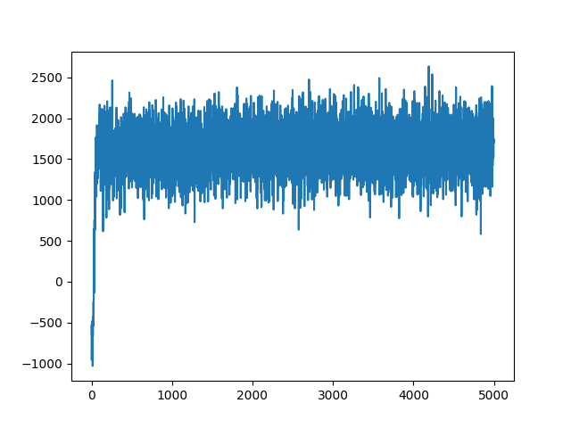

# Pokemon & Q-Learning

### Training Utility Curve



### Prerequisites
*   Java JDK 8+
*   The `pokePA-1.1.0.jar` library in `/lib`

### Build & Run
Compile src files:
```bash
mkdir -p bin
javac -cp "./lib/*" -d ./bin @pokePA.srcs
```

Parallel training loop:
```bash
java -cp "./lib/*:./bin" edu.bu.pas.pokemon.ParallelTrain \
    edu.bu.pas.pokemon.agents.RandomAgent \
    edu.bu.pas.pokemon.agents.AggroAgent \
    -p 5000 \
    -t 30 \
    -v 10 \
    -b 4096 \
    -m 256 \
    -u 5 \
    -n 0.0001 \
    -g 0.95 \
    -d adam \
    -j 4
```
